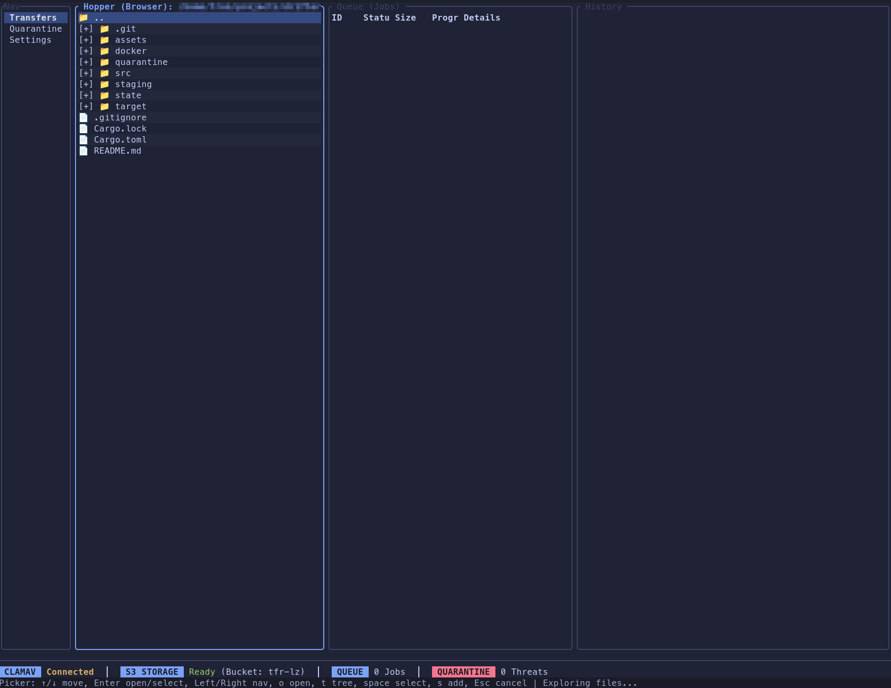

# Drifter

**Drifter** is a mission-critical, TUI-based S3 multipart uploader designed for high-assurance environments. It acts as a robust "tiered storage" airlock, allowing you to stage files, scan them for malware using ClamAV, and upload them to S3-compatible storage with cryptographic integrity verification.



## 🌟 Key Features

### 🛡️ Secure & Reliable Pipeline
- **End-to-End Data Integrity**: Calculates SHA256 checksums locally and verifies them against S3's calculated checksums after upload. You get cryptographic proof that your data arrived exactly as it left.
- **Resumable Transfers**: All job state is persisted in a local SQLite database (`drifter.db`). If the app crashes or power fails, Drifter resumes uploads exactly where they left off (using S3's `list_parts` to skip already-uploaded chunks).
- **Exponential Backoff**: Automatically handles transient network or S3 errors with a smart retry policy (5s, 10s, 20s, 40s, 80s), keeping your pipeline moving without manual intervention.
- **ClamAV Integration**: Automatically quarantines files detected as threats before they ever touch the cloud.

### 🚀 High Performance
- **Async Architecture**: Built on `tokio`, Drifter performs file ingestion, scanning, and uploading asynchronously. The UI never freezes, even when processing terabytes of data.
- **Parallel Multipart Uploads**: Maximizes bandwidth by uploading multiple file parts concurrently.
- **Streaming Metrics**: Live view of upload speed (MB/s) and estimated time of arrival (ETA).

### 👁️ Operator-Centric TUI
- **Live Monitoring**: Real-time progress bars for every job.
- **Detailed Inspection**: Drill down into any job to see exact part completion status, checksums (Local vs Remote), and retry countdowns.
- **Theming**: 10+ built-in themes (Nord, Tokyo Night, High Contrast, Transparent) with configurable border styles.

## Installation

### Prerequisites
- **Rust**: `cargo` (for building the app)
- **Docker**: (optional, for running the ClamAV scanner)

### 1. Start ClamAV Scanner
Drifter requires a ClamAV instance reachable via TCP. We've provided a Docker Compose file for quick setup:

```bash
cd docker
docker compose up -d
```
This starts ClamAV on `localhost:3310`.

### 2. Build & Install

#### Option A: System-Wide Install (Recommended)
```bash
# Install directly from source
cargo install --path .

# Run from anywhere
drifter
```

#### Option B: Build Release Binary
```bash
cargo build --release
./target/release/drifter
```

## Setup & Configuration

On first run, Drifter will launch a **Setup Wizard** to configure:
1.  **Directories**: Staging (temp storage) and Quarantine locations.
2.  **Scanner**: Host/Port for ClamAV.
3.  **S3**: Bucket, Region, Endpoint (AWS, MinIO, Wasabi, etc.), and Credentials.
4.  **Performance**: Part size (5MB - 5GB) and concurrency levels.

_Settings are stored securely in `state/drifter.db`._

## Usage Workflow

### 1. Navigation
- **Tab / Shift+Tab**: Switch between panels (Rail, Browser, Queue).
- **Up / Down**: Navigate lists.
- **Enter**: Select / Confirm / View Details.

### 2. File Browser (Hopper)
- **Space**: Select/Deselect files.
- **s**: **Stage** selected files (Adds to Queue).
- **a**: Toggle "Browse" focus.

### 3. Queue Management
- **r**: Manually retry a failed job.
- **p**: Pause/Resume a job.
- **c**: Clear completed jobs from view.
- **d**: Cancel/Delete a job.

### 4. Job Details
Select a job in the queue and press **Enter** to see:
- **Status**: Uploading, Scanning, Retry Pending, or Complete.
- **Progress**: Detailed multipart bar.
- **Integrity**: **Local** SHA256 vs **Remote** SHA256 (Green = Verified).

## License

MIT